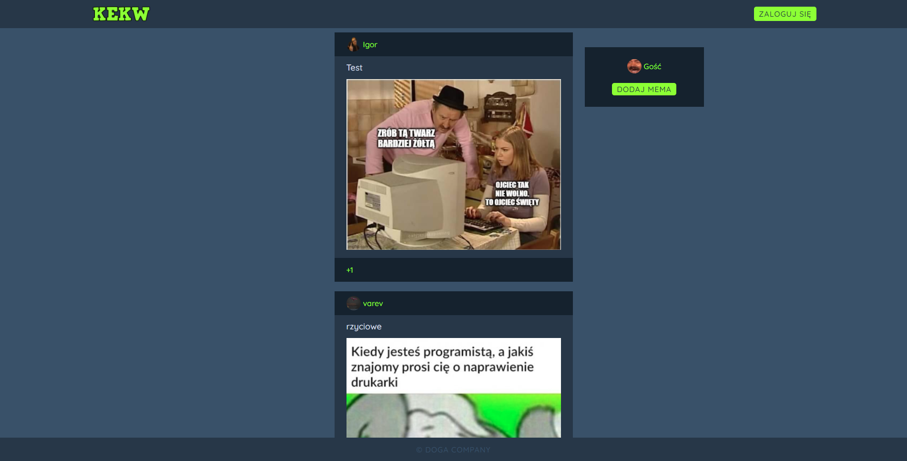

# MemeWebsite
* [General info](#general-info)
* [Technologies](#technologies)

## General info
Meme website created in 2 days.  
It have functional login/register with sha256, guest profile, add and vote for meme.  
It still have some bugs and test photos but it even works.

## Technologies
Project is created with:
* Flask~=2.0.1
* Werkzeug~=2.0.1
* WTForms~=2.3.3
* Pillow~=8.2.0